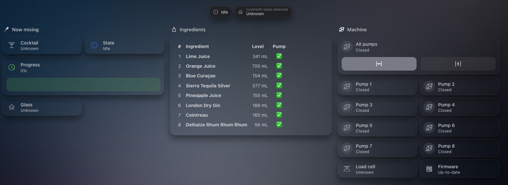

# Home Assistant integration for CocktailPi

[](https://github.com/rizz360/ha-cocktailpi/actions/workflows/validate.yml)
[](https://github.com/hacs/integration)
[](https://github.com/rizz360/ha-cocktailpi/releases)
[](LICENSE)



A custom integration for [CocktailPi](https://github.com/alex9849/CocktailPi) that connects your
cocktail maker to Home Assistant. An API reference is maintained at
[`docs/api.md`](docs/api.md) for anyone looking to build on top of it. A ready-made
dashboard (screenshot + copy-paste YAML) lives in [`docs/dashboard.md`](docs/dashboard.md).

This repo includes a `hacs.json`, so it can be added to HACS as a custom repository, or installed
manually.


## Installation

### HACS (custom repository)

1. In HACS, go to **Integrations → ⋮ → Custom repositories**.
2. Add `https://github.com/rizz360/ha-cocktailpi` with category **Integration**.
3. Install "CocktailPi", then restart Home Assistant.
4. Add the integration via **Settings → Devices & Services → Add Integration → CocktailPi**.

### Manual

Copy `custom_components/cocktailpi/` into your Home Assistant config directory's
`custom_components/` folder, then restart Home Assistant and add the integration via
**Settings → Devices & Services → Add Integration → CocktailPi**.

You'll need the host/port of your CocktailPi instance and a username/password for a user with at
least the `PUMP_INGREDIENT_EDITOR` role (needed to start/stop pumps; `ADMIN` if you also want to
use pump-editing features later).

### Troubleshooting: "Already in progress"

If a setup attempt is interrupted (e.g. the CocktailPi machine was unreachable and you closed the
dialog without it finishing), Home Assistant can be left with a stale config flow that blocks
retrying with the same host/port, showing an `already_in_progress` error. This isn't shown
anywhere in the UI as a pending/discovered item, and there's no way to clear it short of
**restarting Home Assistant** — after a restart, adding the integration again should work.

## Features

- **Pump monitoring**: a fill-level sensor (mL) and a status sensor (current ingredient + pump
  state) per pump, polled over REST every 30s by default (configurable from 10–300s via the
  integration's **Configure** dialog).
- **Pump control**: each pump is exposed as a `valve` entity — *open* starts the pump, *close*
  stops it — plus one aggregate "All pumps" valve. There are also `pump_up`/`pump_back` entity
  services (target a pump valve) to prime/reverse-prime a pump's tube.
- **Cocktail ordering & progress**: `cocktailpi.order_cocktail` and `cocktailpi.cancel_cocktail`
  services, plus a "Current cocktail" sensor showing the recipe name currently in production
  (state/progress/instruction as attributes), a "Cocktail progress" sensor (0-100%, back to 0%
  once the backend clears the finished order), and a "Cocktail state" sensor (idle,
  ready_to_start, running, manual_ingredient_add, manual_action_required, finished, cancelled,
  error) — these reflect orders placed from *anywhere* (the CocktailPi touchscreen included), not
  just from Home Assistant.
- **System info**: CocktailPi's version is attached as the hub device's `sw_version`.
- **Reauthentication**: if the CocktailPi credentials stop working, Home Assistant prompts to
  re-enter them instead of silently retrying.
- **Diagnostics**: a redacted diagnostics download (Settings → Devices & Services → CocktailPi →
  ⋮ → Download diagnostics) for issue reports.
- **Translations**: English, German, French, and Spanish for the config flow, entity names, and
  services.

## Architecture notes

- Pump/system state is REST-polled (simple, robust). There's no REST endpoint for "what's
  currently being made" or a pump's live running state — those are WebSocket-push only in the
  CocktailPi backend — so a small STOMP-over-WebSocket client (`ws.py`) runs alongside the
  poller just for those two things. See the "WebSocket" section of `docs/api.md`.
- Because pump running-state also has no REST equivalent, each pump valve's reported open/closed
  state is *optimistic* until the first WS `runningstate` message arrives for that pump, then
  becomes authoritative. The "All pumps" valve has no per-aggregate WS topic, so it's always
  optimistic (`assumed_state`).
- Login uses `remember: true`, which the backend gives a ~10 year token — no token-refresh logic
  is implemented since re-login basically never becomes necessary during normal operation; a 401
  triggers one automatic re-login/retry regardless.
- Pumps are assumed static after startup: a pump added on the CocktailPi side after Home Assistant
  starts won't get entities or a live running-state subscription until the integration reloads.

## Known caveats to revisit

- `docs/api.md` flags a possible bug in the CocktailPi backend's
  `WebSocketSecurityConfig` (an authority-string mismatch that may make the ADMIN-gated WS topics
  unreachable). This integration doesn't touch those topics, so it isn't affected either way — just
  worth knowing about if you extend this further into event-action status/logs.
- Only one CocktailPi instance can be targeted implicitly by the `order_cocktail`/`cancel_cocktail`
  services; with more than one configured, pass `config_entry_id` explicitly.

## Development

```bash
python3 -m venv .venv && .venv/bin/pip install -r requirements_test.txt ruff
.venv/bin/pytest          # run the test suite
ruff check custom_components tests
ruff format --check custom_components tests
```

CI runs HACS validation, hassfest, ruff (lint + format), and pytest on every push and PR.
Releases are cut by release-please from conventional commit messages.

## TODO before publishing

- The icon under `custom_components/cocktailpi/brand/` only renders in Home Assistant's own UI
  (2026.3+, via the brands proxy). The HACS store listing itself sources its icon from
  [home-assistant/brands](https://github.com/home-assistant/brands)
  (`custom_integrations/cocktailpi/`), so a PR there is still needed for HACS to show anything but
  the default icon — this applies regardless of default-repository-list status.
